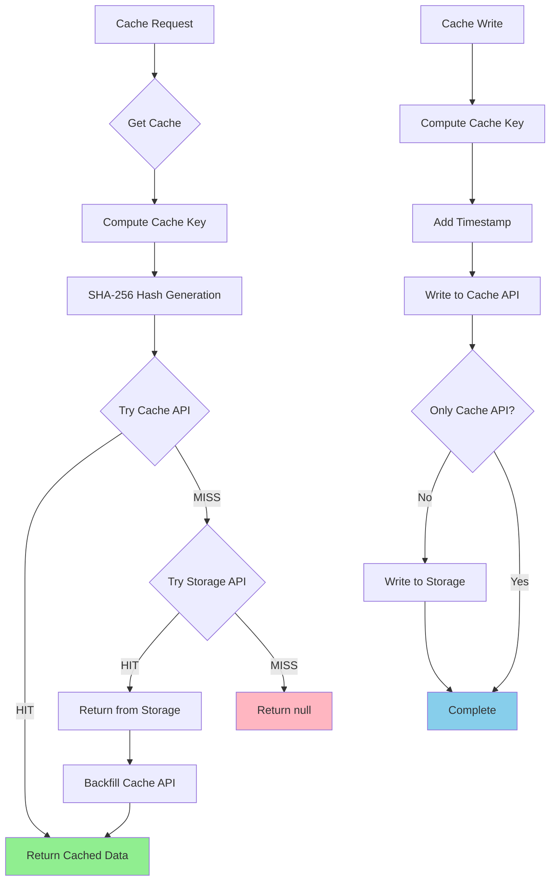

# Incremental Cache Override for Azion

## Overview

The Azion Incremental Cache is a custom implementation that overrides Next.js's default incremental static regeneration (ISR) cache to work with Azion's infrastructure. This implementation provides a dual-layer caching strategy using both Azion's Cache API and Storage services for optimal performance and reliability.

## Architecture

The `StorageIncrementalCache` class implements the `IncrementalCache` interface and provides caching functionality for Next.js applications running on Azion's edge platform. It uses a hybrid approach combining:

1. **Cache API**: Fast, memory-based caching for frequently accessed data
2. **Storage API**: Persistent storage for long-term cache retention

## Key Features

- **Dual-layer caching**: Combines Cache API (fast access) with Storage API (persistence)
- **Automatic fallback**: Falls back to Storage when Cache API misses
- **Cache key hashing**: Uses SHA-256 to create valid cache keys from complex strings
- **Build-aware caching**: Incorporates build ID for cache invalidation
- **Debug logging**: Comprehensive logging for cache operations when enabled

## Cache Key Generation

The cache system uses a sophisticated key generation strategy to handle complex cache keys:

```typescript
function computeCacheKey(key: string, options: KeyOptions) {
  const { cacheType = "cache", prefix = DEFAULT_PREFIX, buildId = FALLBACK_BUILD_ID } = options;
  const hash = createHash("sha256").update(key).digest("hex");
  return `${prefix}/${buildId}/${hash}.${cacheType}`.replace(/\/+/g, "/");
}
```

### Key Components:

- **Prefix**: Default is "incremental-cache"
- **Build ID**: Ensures cache invalidation between deployments
- **SHA-256 Hash**: Converts complex keys into valid storage identifiers
- **Cache Type**: Differentiates between "cache" and "fetch" entries

## Cache Flow Diagram



## API Methods

### `get<CacheType>(key: string, cacheType?: CacheType)`

Retrieves cached data with the following flow:

1. **Key Processing**: Computes hashed cache key using SHA-256
2. **Cache API Lookup**: Attempts to retrieve from fast Cache API
3. **Storage Fallback**: If Cache API misses, tries Storage API
4. **Backfill Strategy**: Populates Cache API when data is found in Storage
5. **Data Parsing**: Deserializes JSON data and adds lastModified timestamp

**Returns**: `WithLastModified<CacheValue<CacheType>> | null`

### `set<CacheType>(key: string, value: CacheValue<CacheType>, cacheType?: CacheType)`

Stores data in both cache layers:

1. **Key Computation**: Generates hashed cache key
2. **Data Serialization**: Adds timestamp and converts to JSON
3. **Dual Write**: Writes to both Cache API and Storage API
4. **Error Handling**: Throws `RecoverableError` on failure

### `delete(key: string)`

Removes cached entries (currently logs deletion intent).

## Cache Types

The system supports two cache types:

- **`cache`**: Standard page and data cache entries
- **`fetch`**: Cached fetch requests (stored in `__fetch/` subdirectory)

## Storage Structure

Cache entries are organized in the following structure:

```
data-cache/
└── _next_cache/
    ├── {hashed-key}.cache          # Standard cache entries
    └── __fetch/
        └── {hashed-key}.fetch      # Fetch cache entries
```

## Environment Configuration

The cache system relies on several environment variables and context:

- **`NEXT_BUILD_ID`**: Build identifier for cache invalidation
- **`AZION.CACHE_API_STORAGE_NAME`**: Cache API storage identifier
- **`AZION.BUCKET_PREFIX`**: Storage bucket prefix
- **`AZION.Storage`**: Storage API instance
- **`NEXT_PRIVATE_DEBUG_CACHE`**: Enables debug logging

## Error Handling

The implementation uses two types of errors:

- **`RecoverableError`**: For operations that can be retried (set/delete failures)
- **`IgnorableError`**: For expected misses that shouldn't break the application

## Performance Characteristics

### Cache API Benefits:

- **Fast Access**: Memory-based storage for quick retrieval
- **Edge Distribution**: Available across Azion's edge network
- **Automatic Expiration**: Built-in TTL management

### Storage API Benefits:

- **Persistence**: Survives edge node restarts
- **Capacity**: Larger storage capacity for extensive caches
- **Durability**: Reliable long-term storage

## Debug Information

When `NEXT_PRIVATE_DEBUG_CACHE` is enabled, the system provides detailed logging:

- Cache hit/miss information
- Key transformations (original → hashed)
- Storage operation results
- Error details and recovery attempts

## Integration with Next.js

This cache implementation seamlessly integrates with Next.js ISR features:

- **Static Generation**: Caches statically generated pages
- **Incremental Regeneration**: Supports background revalidation
- **API Routes**: Caches API response data
- **Fetch Caching**: Handles `fetch()` request caching

## Best Practices

1. **Monitor Cache Performance**: Use debug logging to understand cache behavior
2. **Build ID Management**: Ensure proper build ID generation for cache invalidation
3. **Error Handling**: Implement proper fallbacks for cache failures
4. **Key Complexity**: The system handles complex keys automatically via hashing
5. **Storage Limits**: Be aware of Azion's storage quotas and limits

## Troubleshooting

### Common Issues:

1. **Cache Misses**: Check build ID consistency and key generation
2. **Storage Errors**: Verify Azion Storage configuration and permissions
3. **Performance Issues**: Monitor Cache API vs Storage API hit rates
4. **Key Conflicts**: The SHA-256 hashing prevents most key-related issues

### Debug Steps:

1. Enable `NEXT_PRIVATE_DEBUG_CACHE=1`
2. Monitor cache operation logs
3. Verify environment configuration
4. Check Azion service status and quotas
