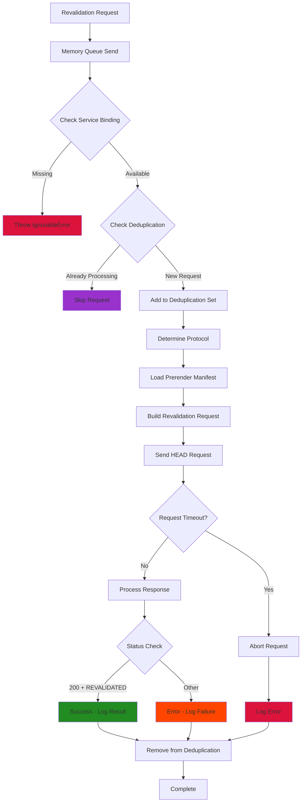

# Memory Queue Override for Azion

## Overview

The Azion Memory Queue is a lightweight implementation that provides Incremental Static Regeneration (ISR) revalidation capabilities for Next.js applications running on Azion's edge platform. This queue system enables on-demand revalidation of cached pages by making internal HTTP requests to trigger regeneration.

## Architecture

The `MemoryQueue` implements the `Queue` interface and provides a simple, in-memory queuing system for ISR revalidation requests. It operates within the edge worker context and uses Azion's service bindings to perform revalidation operations.

## Key Features

- **In-Memory Deduplication**: Prevents duplicate revalidation requests within the same isolate
- **Timeout Protection**: Configurable timeout to prevent hanging revalidation requests
- **Self-Reference Execution**: Uses worker self-reference to trigger revalidations
- **Protocol Detection**: Automatically detects HTTP/HTTPS based on host
- **Status Validation**: Verifies successful revalidation through response headers

## Queue Message Structure

The queue processes messages with the following structure:

```typescript
interface QueueMessage {
  MessageBody: {
    host: string; // Target host for revalidation
    url: string; // Path to revalidate
  };
  MessageDeduplicationId: string; // Unique identifier for deduplication
}
```

## Revalidation Flow Diagram



## API Methods

### `send(message: QueueMessage): Promise<void>`

Processes a revalidation request for a specific URL.

**Parameters**:

- `MessageBody.host`: Target hostname for the revalidation request
- `MessageBody.url`: Path to be revalidated
- `MessageDeduplicationId`: Unique identifier to prevent duplicate processing

**Flow**:

1. **Service Binding Check**: Verifies `WORKER_SELF_REFERENCE` is available
2. **Deduplication**: Checks if the request is already being processed
3. **Protocol Detection**: Determines HTTP/HTTPS based on hostname
4. **Manifest Loading**: Imports prerender manifest for preview mode ID
5. **Request Execution**: Sends HEAD request with ISR headers
6. **Response Validation**: Checks status and revalidation headers
7. **Cleanup**: Removes request from deduplication set

**Request Headers**:

```typescript
{
  "x-prerender-revalidate": manifest.preview.previewModeId,
  "x-isr": "1"
}
```

**Success Criteria**:

- Response status: `200`
- Response header: `x-nextjs-cache: "REVALIDATED"`

## Deduplication System

The queue implements in-memory deduplication to prevent redundant revalidation requests:

### Deduplication Logic

```typescript
// Check if already processing
if (this.revalidatedPaths.has(MessageDeduplicationId)) return;

// Add to processing set
this.revalidatedPaths.add(MessageDeduplicationId);

// Always cleanup in finally block
finally {
  this.revalidatedPaths.delete(MessageDeduplicationId);
}
```

### Benefits:

- **Resource Efficiency**: Prevents multiple workers from revalidating the same path
- **Performance**: Reduces unnecessary network requests
- **Consistency**: Ensures single revalidation per unique request

## Configuration Options

### Constructor Options

```typescript
interface MemoryQueueOptions {
  revalidationTimeoutMs: number; // Default: 10,000ms (10 seconds)
}
```

### Default Configuration

- **Timeout**: 10 seconds (`DEFAULT_REVALIDATION_TIMEOUT_MS`)
- **Method**: HEAD request (lightweight revalidation)
- **Protocol**: Auto-detection (HTTP for localhost, HTTPS otherwise)

## Protocol Detection

The queue automatically determines the appropriate protocol:

```typescript
const protocol = host.includes("localhost") ? "http" : "https";
```

**Logic**:

- **Development**: Uses HTTP for localhost environments
- **Production**: Uses HTTPS for all other hosts
- **Flexibility**: Supports both local development and production deployments

## Error Handling

The implementation provides comprehensive error handling:

### Error Types

1. **Service Binding Error**:

   ```typescript
   throw new IgnorableError("No service binding for cache revalidation worker");
   ```

2. **Revalidation Failure**:

   ```typescript
   if (response.status !== 200 || response.headers.get("x-nextjs-cache") !== "REVALIDATED") {
     error(`Revalidation failed for ${url} with status ${response.status}`);
   }
   ```

3. **Request Timeout**:
   ```typescript
   signal: AbortSignal.timeout(this.opts.revalidationTimeoutMs);
   ```

### Error Recovery

- **Graceful Degradation**: Logs errors but doesn't crash the application
- **Cleanup Guarantee**: Always removes requests from deduplication set
- **Timeout Protection**: Prevents hanging requests from blocking the queue

## Environment Requirements

### Required Service Bindings

- **`WORKER_SELF_REFERENCE`**: Service binding to the worker itself for internal requests

### Required Files

- **`.next/prerender-manifest.json`**: Contains preview mode configuration

### Environment Context

- **Azion Context**: Access to environment variables and service bindings
- **Worker Runtime**: Must run within Azion's edge worker environment

## Integration with Next.js ISR

### Revalidation Trigger

```typescript
// Next.js calls revalidate() which queues a message
await queue.send({
  MessageBody: {
    host: "example.com",
    url: "/products/123",
  },
  MessageDeduplicationId: "unique-request-id",
});
```

### ISR Headers

The queue sends specific headers to trigger ISR:

- **`x-prerender-revalidate`**: Preview mode ID from manifest
- **`x-isr`**: Flag indicating ISR request

### Response Validation

Next.js responds with:

- **Status**: `200` for successful revalidation
- **Header**: `x-nextjs-cache: "REVALIDATED"` to confirm regeneration

## Performance Characteristics

### Memory Usage

- **Lightweight**: Minimal memory footprint with simple Set-based deduplication
- **Bounded**: Deduplication set automatically cleans up completed requests
- **Efficient**: No persistent storage required

### Network Efficiency

- **HEAD Requests**: Uses lightweight HEAD method instead of GET
- **Timeout Protection**: Prevents resource exhaustion from hanging requests
- **Deduplication**: Reduces redundant network calls

### Latency Considerations

- **Internal Requests**: Uses worker self-reference for minimal latency
- **Edge Execution**: Runs at edge locations for reduced round-trip time
- **Async Processing**: Non-blocking queue operations

## Debug Information

Enable detailed logging with debug flags:

```typescript
debugCache("memory-queue", this.opts, host, url, MessageDeduplicationId);
debugCache(`Revalidation successful for ${url}`);
```

**Debug Output Includes**:

- Queue configuration options
- Request parameters (host, URL, deduplication ID)
- Revalidation success/failure status
- Error details and stack traces

## Best Practices

1. **Timeout Configuration**: Adjust timeout based on page complexity and generation time
2. **Deduplication IDs**: Use meaningful, unique identifiers for proper deduplication
3. **Error Monitoring**: Monitor revalidation failures for performance insights
4. **Service Binding**: Ensure proper worker self-reference configuration
5. **Manifest Management**: Keep prerender manifest up-to-date with deployments

## Common Use Cases

### On-Demand Revalidation

```typescript
// Revalidate product page after inventory update
await queue.send({
  MessageBody: {
    host: "shop.example.com",
    url: "/products/laptop-123",
  },
  MessageDeduplicationId: `product-123-${Date.now()}`,
});
```

### Batch Revalidation

```typescript
// Revalidate multiple related pages
const pages = ["/category/electronics", "/products/123", "/products/456"];
for (const url of pages) {
  await queue.send({
    MessageBody: { host: "example.com", url },
    MessageDeduplicationId: `batch-${url}-${Date.now()}`,
  });
}
```

### Scheduled Revalidation

```typescript
// Revalidate homepage periodically
await queue.send({
  MessageBody: {
    host: "example.com",
    url: "/",
  },
  MessageDeduplicationId: `homepage-${Math.floor(Date.now() / 60000)}`, // Per minute
});
```

## Troubleshooting

### Common Issues

1. **Service Binding Missing**:

   - **Symptom**: `IgnorableError: No service binding for cache revalidation worker`
   - **Solution**: Configure `WORKER_SELF_REFERENCE` in Azion environment

2. **Revalidation Failures**:

   - **Symptom**: Status !== 200 or missing `x-nextjs-cache` header
   - **Solution**: Check Next.js ISR configuration and page implementation

3. **Timeout Issues**:

   - **Symptom**: Requests timing out frequently
   - **Solution**: Increase `revalidationTimeoutMs` or optimize page generation

4. **Manifest Import Errors**:
   - **Symptom**: Cannot import prerender manifest
   - **Solution**: Ensure `.next/prerender-manifest.json` is included in deployment

### Debug Steps

1. **Enable Debug Logging**: Set appropriate debug flags
2. **Check Service Bindings**: Verify worker self-reference configuration
3. **Monitor Response Headers**: Validate ISR response headers
4. **Test Timeout Settings**: Adjust timeout based on page complexity
5. **Verify Manifest**: Ensure prerender manifest is accessible

## Limitations

1. **In-Memory Only**: Deduplication doesn't persist across worker restarts
2. **Single Worker**: Deduplication scope limited to individual worker instances
3. **Manifest Dependency**: Requires prerender manifest for preview mode ID
4. **Protocol Assumption**: Simple localhost detection for protocol selection

## Future Improvements

1. **Distributed Deduplication**: Cross-worker deduplication using shared storage
2. **Advanced Retry Logic**: Exponential backoff for failed revalidations
3. **Metrics Collection**: Detailed performance and success rate tracking
4. **Dynamic Timeout**: Adaptive timeout based on historical performance
