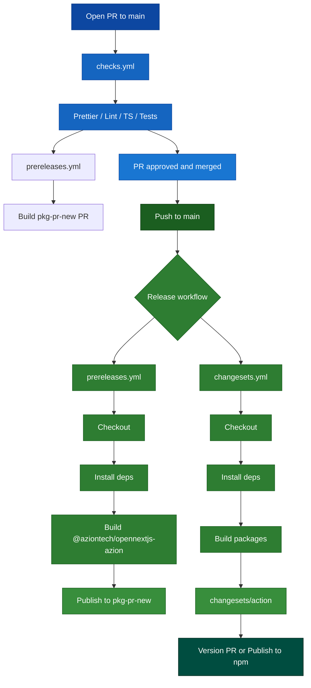

# opennextjs Release Workflow Diagram

## Description

This GitHub Actions setup automates the CI and release process for the `opennextjs` package using **Checks** + **Changesets** and two release workflows: `prereleases.yml` and `changesets.yml`.

- **Trigger conditions**

  - **CI (`checks.yml`)** runs on pull requests targeting `main` and on pushes to `main`.
  - **Pre-releases (`prereleases.yml`)** run on every `push` to `main` and on `pull_request` events (PRs opened/updated against `main`), generating prerelease builds on pkg-pr-new.
  - **Stable releases (`changesets.yml`)** run on every `push` to the `main` branch to produce the official npm release.

- **Release flow (simplified)**

  - `checks.yml` runs formatting, lint, type-check and tests for each PR and push.
  - Checkout code and configure Node.js 20 in the release workflows.
  - Install dependencies and build the project (`npm run compile`).
  - Run Changesets to determine the next version, update changelogs and prepare publish.
  - **Publish the package to the npm registry** using the configured npm token.
  - **Important**: for `changesets.yml` to actually create a new release, the merged PR must include at least one Changeset file in `.changeset/*.md`.

---

- **Prerelease job (`prereleases.yml`)** (runs on `main` as prerelease flow)

  - **Checkout** the repository with full history.
  - **Install dependencies** using the shared `install-dependencies` action.
  - **Build the opennextjs package** by running `pnpm -F @aziontech/opennextjs-azion run build`.
  - **Publish a prerelease build** by running `pnpm exec pkg-pr-new publish --pnpm --compact './packages/azion'`.

- **Release job (`changesets.yml`)** (runs on every push to `main`)

  - **Checkout** the repository with full history (`fetch-depth: 0`) using a GitHub token (for example `CUSTOM_GITHUB_TOKEN`).
  - **Setup Node.js** version 20 and enable npm cache for faster installs.
  - **Install dependencies** using `npm install` or `npm ci`.
  - **Build the project** by running `npm run compile`.
  - **Run Changesets**:
    - `changeset version` reads pending `.changeset` files, decides patch/minor/major bumps, updates `package.json` and changelogs.
    - `changeset publish` publishes the new stable version to npm, authenticated with `NPM_TOKEN`, usually under the `latest` dist-tag.
