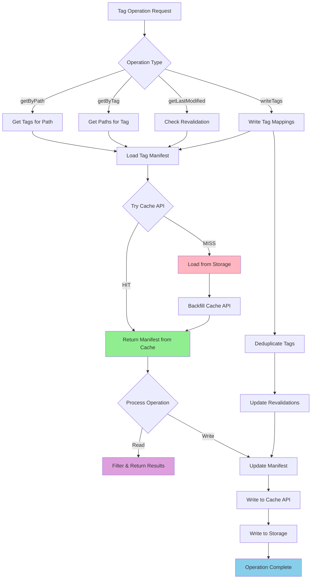

# Tag Cache Override for Azion

## Overview

The Azion Tag Cache is a custom implementation that manages cache tags for Next.js applications running on Azion's edge platform. This system enables efficient cache invalidation by associating cache entries with tags, allowing for selective revalidation of related content when data changes.

## Architecture

The `StorageTagCache` implements the `TagCache` interface and provides tag-based cache management using Azion's dual-layer storage approach:

1. **Cache API**: Fast access to tag manifests for quick lookups
2. **Storage API**: Persistent storage of tag manifests for durability
3. **Tag Manifest**: Central registry mapping tags to paths and tracking revalidations

## Key Features

- **Tag-to-Path Mapping**: Associates cache tags with specific paths
- **Path-to-Tag Lookup**: Finds all tags associated with a given path
- **Revalidation Tracking**: Manages forced revalidation timestamps
- **Dual-layer Storage**: Combines Cache API speed with Storage API persistence
- **Build-aware Tagging**: Incorporates build ID for proper cache isolation

## Tag Manifest Structure

The tag manifest is a JSON structure that maintains the relationship between tags and paths:

```typescript
type TagsManifest = {
  items: { tag: string; path: string }[];
  revalidations?: { tag: string; path: string; revalidatedAt?: number }[];
};
```

### Components:

- **`items`**: Core tag-to-path mappings
- **`revalidations`**: Tracks when specific tag-path combinations were revalidated

## Cache Flow Diagram



## API Methods

### `getByPath(path: string): Promise<string[]>`

Retrieves all tags associated with a specific path.

**Flow**:

1. Loads tag manifest from Cache API or Storage
2. Filters items matching the given path
3. Returns array of tag names (with build ID prefix removed)

**Example**:

```typescript
const tags = await tagCache.getByPath("/products/123");
// Returns: ['product', 'category:electronics', 'user:456']
```

### `getByTag(tag: string): Promise<string[]>`

Retrieves all paths associated with a specific tag.

**Flow**:

1. Loads tag manifest from Cache API or Storage
2. Filters items matching the given tag
3. Returns array of path names (with build ID prefix removed)

**Example**:

```typescript
const paths = await tagCache.getByTag("product");
// Returns: ['/products/123', '/products/456', '/api/products']
```

### `getLastModified(key: string, lastModified: number): Promise<number>`

Determines if a cache entry should be revalidated based on tag revalidation timestamps.

**Flow**:

1. Loads tag manifest and revalidations
2. Checks if any associated tags have been revalidated after the entry's last modified time
3. Returns `-1` to force revalidation or the original timestamp

**Revalidation Logic**:

- If a tag was revalidated after the entry's `lastModified` time, returns `-1`
- Otherwise, returns the original `lastModified` timestamp

### `writeTags(tags: Array<{tag: string, path: string, revalidatedAt?: number}>): Promise<void>`

Updates tag mappings and revalidation timestamps.

**Flow**:

1. Loads current tag manifest
2. Deduplicates incoming tags
3. Updates revalidations map with new timestamps
4. Writes updated manifest to both Cache API and Storage

**Features**:

- **Deduplication**: Prevents duplicate tag entries
- **Merge Strategy**: Updates existing revalidations or adds new ones
- **Atomic Updates**: Ensures consistency across both storage layers

## Storage Structure

Tag manifests are stored in the following location:

```
data-cache/
└── _next_cache/
    └── cache-tags-manifest.cache    # Central tag manifest file
```

## Key Generation Strategy

The system uses build-aware key generation:

```typescript
const getCacheKey = (key: string) => {
  return `${BUILD_ID}/${key}`.replaceAll("//", "/");
};
```

This ensures:

- **Build Isolation**: Different builds maintain separate tag spaces
- **Path Normalization**: Removes duplicate slashes for consistent keys

## Cache Manifest Management

### Loading Strategy

The system implements a fallback loading strategy:

1. **Primary**: Try Cache API for fast access
2. **Fallback**: Load from Storage if Cache API misses
3. **Backfill**: Populate Cache API when loading from Storage

### Writing Strategy

Updates are written to both layers:

1. **Cache API**: Immediate availability for fast access
2. **Storage API**: Persistent storage with build metadata

## Revalidation System

The tag cache supports sophisticated revalidation tracking:

### Revalidation Map

- Maintains unique entries using `tag|path` composite keys
- Tracks `revalidatedAt` timestamps for each tag-path combination
- Supports forced revalidation by returning `-1` from `getLastModified`

### Revalidation Logic

```typescript
// Force revalidation if tag was revalidated after entry's last modified time
const shouldRevalidate = reval.revalidatedAt > (lastModified ?? 0);
return shouldRevalidate ? -1 : lastModified;
```

## Error Handling

The implementation uses robust error handling:

- **Storage Errors**: Returns empty manifest `{items: []}` if file not found
- **Cache API Errors**: Falls back to Storage API automatically
- **Parse Errors**: Gracefully handles malformed JSON with debug logging

## Environment Configuration

Required environment variables and context:

- **`NEXT_BUILD_ID`**: Build identifier for tag isolation
- **`AZION.CACHE_API_STORAGE_NAME`**: Cache API storage identifier
- **`AZION.BUCKET_PREFIX`**: Storage bucket prefix for manifest location
- **`AZION.Storage`**: Storage API instance for persistent storage

## Integration with Next.js ISR

The tag cache integrates seamlessly with Next.js features:

### On-Demand Revalidation

```typescript
// When revalidateTag() is called
await tagCache.writeTags([
  {
    tag: "product",
    path: "/products/123",
    revalidatedAt: Date.now(),
  },
]);
```

### Cache Invalidation

```typescript
// Check if cache entry should be revalidated
const lastModified = await tagCache.getLastModified(path, entryTimestamp);
if (lastModified === -1) {
  // Force regeneration of cached content
}
```

## Performance Characteristics

### Cache API Benefits

- **Fast Lookups**: Memory-based access for tag manifest
- **Edge Distribution**: Available across Azion's network
- **Low Latency**: Immediate access to tag mappings

### Storage API Benefits

- **Persistence**: Survives edge node restarts
- **Consistency**: Single source of truth for tag manifest
- **Durability**: Reliable storage for tag relationships

## Debug Information

Enable detailed logging with `NEXT_PRIVATE_DEBUG_CACHE=1`:

- Tag manifest load operations (Cache API vs Storage)
- Tag filtering and mapping results
- Revalidation decision logic
- Write operations to both storage layers

## Best Practices

1. **Tag Naming**: Use consistent, hierarchical tag naming (e.g., `category:electronics`)
2. **Granular Tagging**: Tag at appropriate granularity for efficient invalidation
3. **Revalidation Strategy**: Use targeted revalidation to minimize cache churn
4. **Monitor Performance**: Track Cache API hit rates vs Storage fallbacks
5. **Build Management**: Ensure proper build ID generation for tag isolation

## Common Use Cases

### Product Catalog

```typescript
// Tag product pages with multiple categories
await tagCache.writeTags([
  { tag: "product", path: "/products/123" },
  { tag: "category:electronics", path: "/products/123" },
  { tag: "brand:apple", path: "/products/123" },
]);

// Invalidate all Apple products
await tagCache.writeTags([
  {
    tag: "brand:apple",
    path: "/products/123",
    revalidatedAt: Date.now(),
  },
]);
```

### Content Management

```typescript
// Tag blog posts with topics
await tagCache.writeTags([
  { tag: "blog", path: "/blog/post-1" },
  { tag: "topic:technology", path: "/blog/post-1" },
  { tag: "author:john", path: "/blog/post-1" },
]);
```

## Troubleshooting

### Common Issues

1. **Missing Tags**: Check tag manifest loading and Cache API connectivity
2. **Revalidation Not Working**: Verify timestamp comparison logic and tag associations
3. **Performance Issues**: Monitor Cache API vs Storage access patterns
4. **Build Isolation**: Ensure consistent build ID across deployments

### Debug Steps

1. Enable debug logging: `NEXT_PRIVATE_DEBUG_CACHE=1`
2. Check tag manifest structure and content
3. Verify Cache API and Storage API configuration
4. Monitor revalidation timestamps and logic
5. Validate tag-to-path mappings
